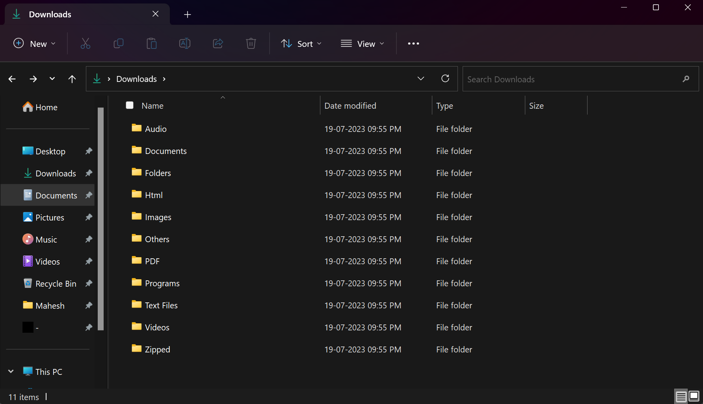

# File-Sorter
This program sorts the files in the downloads folder in a single click easily! This sorts the files based on the extensions
# Installation
To run this program, u can follow either of the ways mentioned below
 - Download and run the latest release
 - Clone this repo and run the main.py file
# Demo 

